

  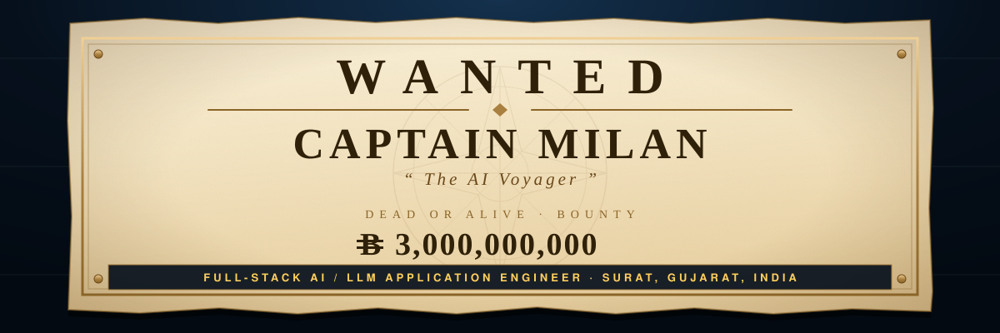

  

<!-- ─────────────  AT A GLANCE  ───────────── -->

<table>
<tr>
<td align="center" width="25%">🎯 <b>Role</b> Full-Stack AI / LLM Application Engineer</td>
<td align="center" width="25%">🧠 <b>Focus</b> RAG · Multi-Agent LLM Workflow Automation</td>
<td align="center" width="25%">📍 <b>Based in</b> Surat, Gujarat India</td>
<td align="center" width="25%">✅ <b>Status</b> Open to opportunities</td>
</tr>
</table>

     

<!-- ─────────────  ABOUT  ───────────── -->

## 👤 About Me

<i>🧭 the Log Pose — where the needle points</i>

<table>
<tr>
<td valign="top" width="80%">

I build **production features on top of foundation models** — retrieval systems, multi-agent LLM
pipelines and workflow automation — and then build the whole product around them.

- 🏢 **Full-Stack AI / LLM Application Engineer** at **Triz Innovation** — intern *(Dec 2025)* → full-time *(Apr 2026 → now)*
- 🔧 Day to day: **Next.js · FastAPI · Laravel · Supabase/pgvector · DeepSeek**
- 🔭 Currently working on hybrid-retrieval RAG, document intelligence at scale, and agentic pipelines that hold up under real users
- 🎓 Final-year **B.Tech Computer Engineering**, CHARUSAT *(2022 – 2026)*
- 💬 Ask me about `pgvector`, `MinerU`, `n8n` — or why my insurance chatbot is **deliberately not LangChain-based**
- ⚔️ This profile is themed after **One Piece**. Every section has a plain label first, so you can ignore the pirates entirely.

> **What I'm looking for** — full-stack AI and LLM application work: retrieval systems, document
> intelligence, agentic pipelines, and the product engineering that turns them into something
> people can actually use.

</td>
<td valign="top" width="20%" align="center">
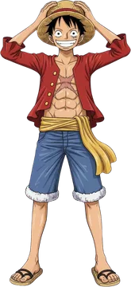
</td>
</tr>
</table>

<!-- ─────────────  TECH STACK  ───────────── -->

## 🛠️ Tech Stack

<i>☠️ the Crew — the tech that sails with the captain</i>

  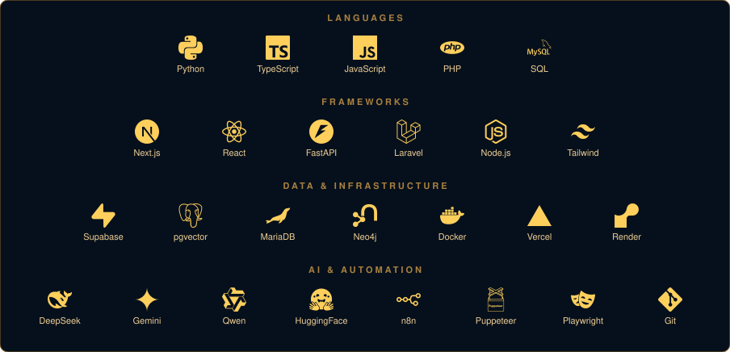

<b>☠️ …and the same stack as a pirate crew, for those who want it</b>

 

| Role | Nakama | What they do |
|:--|:--|:--|
| 🧭 **Navigator** | `Python` | charts every course |
| ⚓ **Helmsman** | `TypeScript` · `JavaScript` | steady hands on the wheel |
| 🔨 **Shipwright** | `Next.js` + `React` | builds and repairs the ship |
| 🍳 **Cook** | `FastAPI` + `Laravel` | serves every request hot |
| 🍎 **Devil Fruit** | `RAG` · `LLMs` · `Multi-Agent` | DeepSeek / Gemini / Qwen powers |
| 📚 **Archaeologist** | `Supabase` · `pgvector` | keeper of the records |
| 🗿 **Log Keeper** | `MariaDB` · `Neo4j` | maps every relation |
| 🎻 **Musician** | `n8n` · `Puppeteer` · `Playwright` | automation that plays itself |
| ⚕️ **Doctor** | `Docker` · `Vercel` · `Render` | keeps ships alive at sea |

<!-- ─────────────  PROJECTS  ───────────── -->

## 📂 Featured Projects

<i>📜 the Bounty Board — every project gets a wanted poster</i>

<table>
<tr>
<td width="33%" valign="top" align="center">
  <a href="https://github.com/Milan-Baldaniya/insuretech">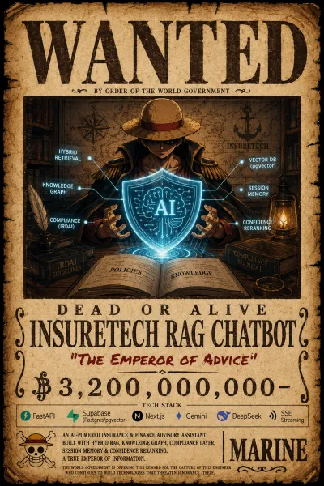</a>
   <b>Insurance RAG Chatbot</b>
   Advisory assistant with hybrid retrieval, citations, an IRDAI compliance engine and SSE streaming. Built without LangChain, on purpose.
    <code>FastAPI</code> <code>pgvector</code> <code>Next.js</code>
   <a href="https://insuretech-wine.vercel.app/">Live ↗</a> · <a href="https://github.com/Milan-Baldaniya/insuretech">Code</a>
</td>
<td width="33%" valign="top" align="center">
  <a href="https://github.com/Milan-Baldaniya/pdf-extraction">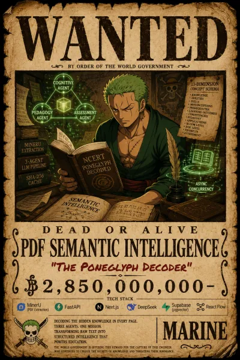</a>
   <b>PDF Semantic Intelligence</b>
   Turns messy textbook PDFs into structured content, then a three-agent LLM pipeline emits a 13-dimension concept schema per topic.
    <code>MinerU</code> <code>DeepSeek</code> <code>React Flow</code>
   <a href="https://github.com/Milan-Baldaniya/pdf-extraction">Code</a>
</td>
<td width="33%" valign="top" align="center">
  <a href="https://lms-k12.vercel.app">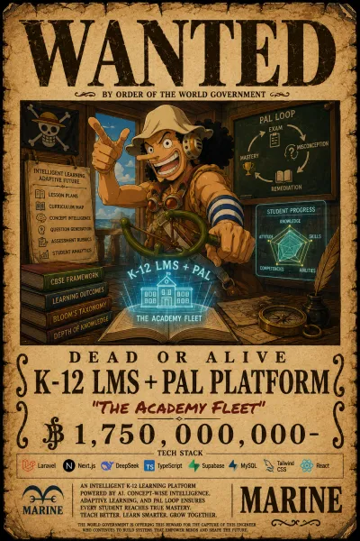</a>
   <b>K-12 LMS + PAL</b>
   Lesson planning, AI-generated classroom content, and an adaptive loop turning exam misconceptions into remediation on the CBSE framework.
    <code>Laravel</code> <code>Next.js</code> <code>DeepSeek</code>
   <a href="https://lms-k12.vercel.app">Live ↗</a> · <a href="https://github.com/Vivek99256/lms_k12">Code</a>
</td>
</tr>
<tr>
<td width="33%" valign="top" align="center">
  <a href="https://g2gv0.vercel.app/">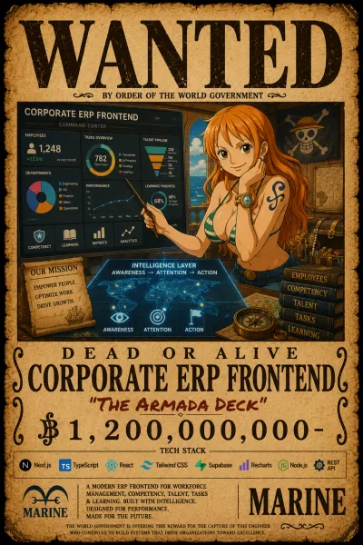</a>
   <b>Corporate ERP Frontend</b>
   The full app frontend for a workforce &amp; competency ERP — org directory, competency, task, learning, rights and the report engine.
    <code>Next.js</code> <code>Design System</code> <code>AI UX</code>
   <a href="https://g2gv0.vercel.app/">Live ↗</a> · <a href="https://github.com/zeeltank/g2gv0">Code</a>
</td>
<td width="33%" valign="top" align="center">
  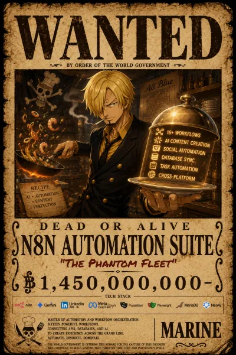
   <b>n8n Automation Suite</b>
   16 self-hosted workflows — AI social publishing, SEO blog generation, MariaDB → Neo4j sync and task classification. Owned end to end.
    <code>n8n</code> <code>Gemini</code> <code>Neo4j</code> <code>Docker</code>
</td>
<td width="33%" valign="top" align="center">
  <a href="https://github.com/Milan-Baldaniya/canva">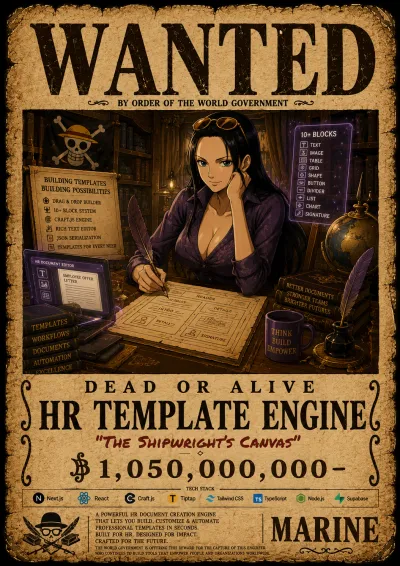</a>
   <b>HR Template Engine</b>
   A Canva-style A4 document editor with a 10-type block system and templates stored as JSON, so HR paperwork stops needing a developer.
    <code>Craft.js</code> <code>Tiptap</code> <code>Next.js</code>
   <a href="https://github.com/Milan-Baldaniya/canva">Code</a>
</td>
</tr>
</table>

<b>📜 Eight more projects on the board</b>

 
<table>
<tr>
<td width="25%" valign="top" align="center">
  <a href="https://gapstogrowth.com">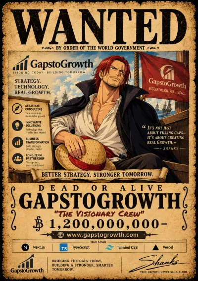</a>
   <b>GapstoGrowth</b>
   48 routes, ~225 components, Spline 3D hero, SEO schema. Primary contributor.
   <a href="https://gapstogrowth.com">Live ↗</a>
</td>
<td width="25%" valign="top" align="center">
  <a href="https://triz.co.in">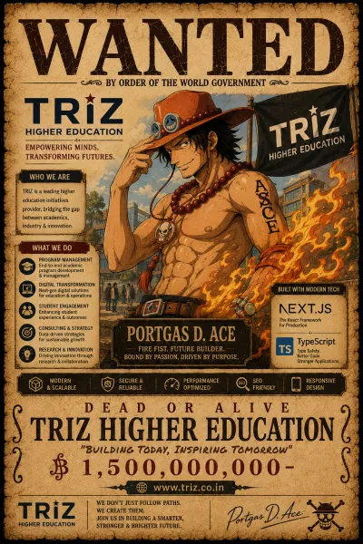</a>
   <b>Triz Higher Education</b>
   23 routes, 85 components, codebase restructure and an automation-fed dynamic blog.
   <a href="https://triz.co.in">Live ↗</a>
</td>
<td width="25%" valign="top" align="center">
  <a href="https://github.com/Milan-Baldaniya/linkedin-connect">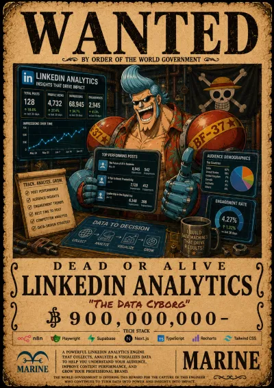</a>
   <b>LinkedIn Analytics</b>
   Playwright scraping of per-post engagement into Supabase, on a live dashboard.
   <a href="https://github.com/Milan-Baldaniya/linkedin-connect">Code</a>
</td>
<td width="25%" valign="top" align="center">
  <a href="https://github.com/Milan-Baldaniya/infographic-renderer">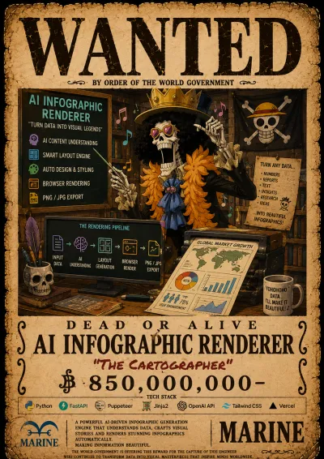</a>
   <b>AI Infographic Renderer</b>
   Headless Chrome turning HTML/CSS into PNG infographics over one endpoint.
   <a href="https://github.com/Milan-Baldaniya/infographic-renderer">Code</a>
</td>
</tr>
<tr>
<td width="25%" valign="top" align="center">
  <a href="https://lms-k12.vercel.app">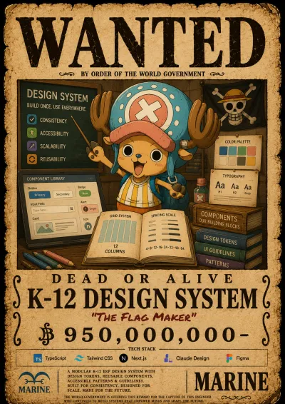</a>
   <b>K-12 Design System</b>
   Tokens, layout system, page templates and a component library driving a prototyping pipeline.
   <a href="https://lms-k12.vercel.app">Live ↗</a>
</td>
<td width="25%" valign="top" align="center">
  <a href="https://g2gv0.vercel.app/">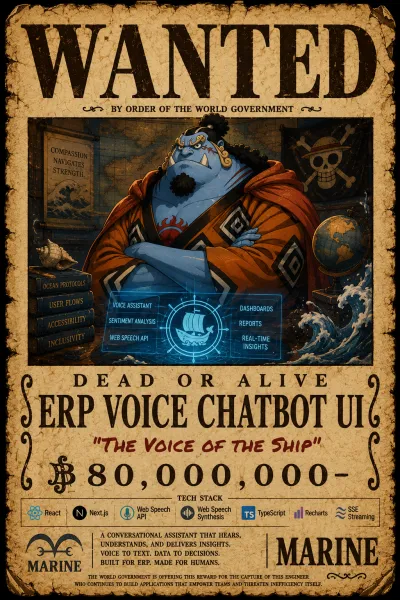</a>
   <b>ERP Voice Chatbot UI</b>
   In-product assistant with a macOS-genie animation and Web Speech voice-to-text.
   <a href="https://g2gv0.vercel.app/">Live ↗</a>
</td>
<td width="25%" valign="top" align="center">
  <a href="https://www.stylenx.com/">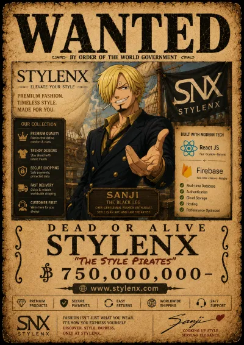</a>
   <b>StyleNX</b>
   Freelance commercial website — brand-led design and a client-editable structure.
   <a href="https://www.stylenx.com/">Live ↗</a>
</td>
<td width="25%" valign="top" align="center">
  <a href="https://www.krushiworld.com/">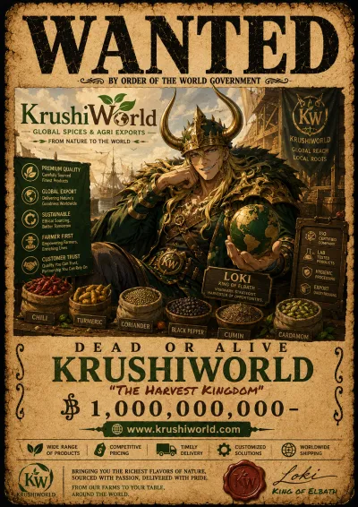</a>
   <b>KrushiWorld</b>
   Freelance agriculture-sector site — product pages, enquiry flow, responsive down to phone.
   <a href="https://www.krushiworld.com/">Live ↗</a>
</td>
</tr>
</table>

<!-- ─────────────  EXPERIENCE  ───────────── -->

## 💼 Experience &amp; Education

<i>⚓ the Voyage So Far — every island on the log</i>

<table>
<tr>
<td valign="top" width="78%">

| | Role | Where | When |
|:--|:--|:--|:--|
| 🏝️ | **Full-Stack AI Engineer** | Triz Innovation, Surat | Dec 2025 → now |
| 🔬 | **ML &amp; Data Analysis Intern** | BrainyBeam Technologies, Ahmedabad | May – Jul 2025 |
| 🌊 | **Web Developer Intern** | Agevole Innovation, Surat | May – Jun 2024 |
| 🎓 | **B.Tech, Computer Engineering** | CHARUSAT, Anand | 2022 – 2026 |

**At Triz I've shipped:** an insurance RAG assistant on FastAPI + pgvector · a MinerU document-intelligence
platform with a three-agent LLM pipeline · concept-wise question and rubric generation for a Laravel/Next.js
K-12 platform · 16 n8n automation workflows · and the Next.js frontends for two ERPs and three marketing sites.

</td>
<td valign="top" width="22%" align="center">

</td>
</tr>
</table>

<!-- ─────────────  ACTIVITY  ───────────── -->

## 📊 GitHub Activity

<i>🗺️ the Voyage Chart — what the logbook records</i>

  
  

  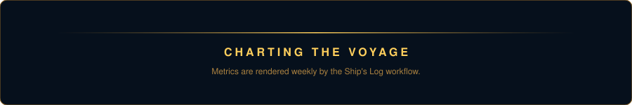

  <picture>
    <source media="(prefers-color-scheme: dark)" srcset="https://raw.githubusercontent.com/Milan-Baldaniya/Milan-Baldaniya/output/snake-dark.svg" />
    <source media="(prefers-color-scheme: light)" srcset="https://raw.githubusercontent.com/Milan-Baldaniya/Milan-Baldaniya/output/snake.svg" />
    
  </picture>

  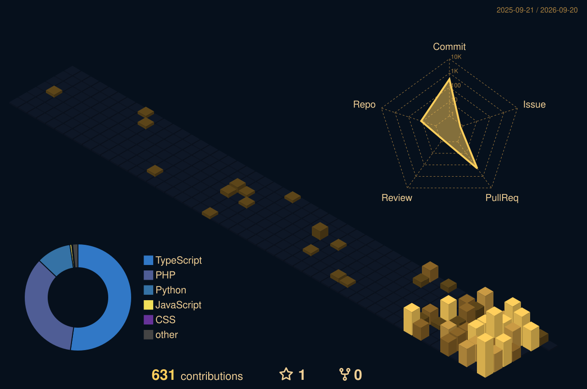

<b>📐 More readings from the instruments</b>

 

  
    
  
  

<!-- ─────────────  PORTFOLIO CTA + GIF  ───────────── -->

## 🚢 Sail the Full Portfolio

<i>an interactive 3D voyage — eight islands, fourteen bounties, one Grand Line</i>

  
    
  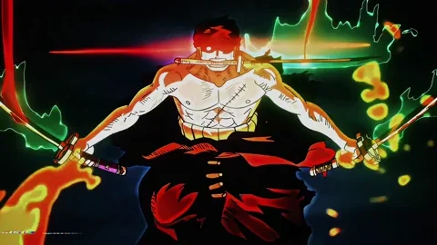
   
  <i>“Nothing happened.”</i>

<!-- ─────────────  CONTACT  ───────────── -->

## 📬 Contact

<i>📡 the Den Den Mushi — ring once and I'll pick up</i>

  
Building something that needs retrieval, agents or automation done properly? Let's talk.

     

  
    
  <i>The treasure was never gold — it was everything the voyage made him.</i>
   
  Themed after One Piece (Eiichiro Oda) — fan-made, not affiliated with or endorsed by Shueisha/Toei.

